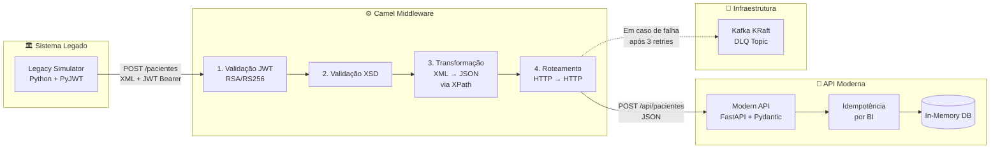

# Apache Camel Integration

> Uma arquitetura de integração enterprise **production-ready** demonstrando interoperabilidade entre sistemas legados e modernos, com segurança JWT (RSA), resiliência via Dead Letter Queue no Kafka, e orquestração completa via Docker Compose.

[](https://camel.apache.org/)
[](https://quarkus.io/)
[-231F20?logo=apachekafka>)](https://kafka.apache.org/)
[](https://fastapi.tiangolo.com/)
[](https://www.docker.com/)
[](LICENSE)

---

## 📋 Índice

- [Visão Geral](#-visão-geral)
- [Problema Resolvido](#-problema-resolvido)
- [Arquitetura](#-arquitetura)
- [Stack Tecnológica](#-stack-tecnológica)
- [Decisões Arquiteturais](#-decisões-arquiteturais)
- [Estrutura do Projeto](#-estrutura-do-projeto)
- [Como Executar](#-como-executar)
- [Fluxo de Dados](#-fluxo-de-dados)
- [Testes e Validações](#-testes-e-validações)
- [Lições Aprendidas](#-lições-aprendidas)
- [Evoluções Futuras](#-evoluções-futuras)
- [Referências](#-referências)

---

## 🎯 Visão Geral

Este projeto é uma **prova de conceito arquitetural** que demonstra como integrar sistemas heterogêneos (legado vs. moderno) de forma segura, resiliente e desacoplada, utilizando **Apache Camel** como middleware de interoperabilidade.

O sistema simula um cenário real de saúde onde:

- Um **sistema legado** (pré-2010) envia dados de pacientes em **XML** via HTTP
- Um **middleware Camel** valida, transforma e roteia as mensagens
- Uma **API moderna** (FastAPI) consome os dados em **JSON**
- Falhas são tratadas com **Dead Letter Queue** no Kafka

---

## 🎯 Problema Resolvido

Em arquiteturas corporativas reais, é comum encontrar:

> _"Um sistema fala SOAP porque foi construído em 2011. Outro só aceita REST com JSON porque nasceu ontem. Um terceiro deposita arquivos numa pasta e considera isso uma API. E, no meio, alguém precisa fazer esses três conversarem sem reescrever nenhum deles."_

Sem uma camada de integração disciplinada, essa responsabilidade vira uma **"gambiarra de scripts"** — um cron job aqui, um tradutor XML→JSON ali, um `try/except` gigante que ninguém entende mais. Quando algo falha, não há logs decentes, não há retry, e a mensagem se perde no éter.

**Apache Camel existe para dar nome, forma e disciplina a essa camada do meio.**

Este projeto demonstra como transformar essa "gororoba" em uma arquitetura **observável, resiliente e manutenível**.

---

## 🏗️ Arquitetura



### Componentes

| Serviço            | Tecnologia                  | Responsabilidade                                     |
| :----------------- | :-------------------------- | :--------------------------------------------------- |
| `legacy-simulator` | Python 3.11 + PyJWT         | Simula sistema legado, assina JWT com RSA, envia XML |
| `camel-middleware` | Quarkus 3.8.1 + Camel 4.4.0 | Autenticação, validação, transformação, roteamento   |
| `modern-api`       | FastAPI + Pydantic          | Recebe JSON, valida, aplica idempotência, persiste   |
| `kafka`            | Confluent 7.6.0 (KRaft)     | Dead Letter Queue para mensagens com falha           |

### 🛠️ Stack Tecnológica

#### Por que cada tecnologia foi escolhida?

| Tecnologia            | Justificativa                                                                                                       |
| :-------------------- | :------------------------------------------------------------------------------------------------------------------ |
| `Apache Camel 4.4`    | Framework líder em integração enterprise, 300+ componentes, suporte nativo a EIPs (Enterprise Integration Patterns) |
| `Quarkus 3.8`         | Runtime Java otimizado para containers, startup rápido (~1.5s), baixo consumo de memória, ideal para middleware     |
| `Kafka (KRaft)`       | Modo KRaft elimina a dependência do Zookeeper (depreciado), reduzindo complexidade operacional                      |
| `FastAPI`             | Validação automática via Pydantic, documentação OpenAPI nativa, performance assíncrona                              |
| `JWT com RSA (RS256)` | Criptografia assimétrica: o legado assina com chave privada, o middleware valida com pública. Padrão enterprise     |
| `Docker Compose`      | Orquestração local de múltiplos serviços, reproduzível em qualquer ambiente                                         |
| `YAML DSL`            | Rotas declarativas, legíveis, separadas do código Java (princípio da separação de preocupações)                     |

### 🎯 Decisões Arquiteturais

Esta seção documenta as decisões técnicas mais importantes do projeto, seguindo o formato ADR (_Architecture Decision Record_).

#### **ADR-001: Idempotência é responsabilidade do destino, não do middleware**

- **Contexto:** O mesmo paciente pode ser enviado múltiplas vezes pelo sistema legado (ex: retry de rede, reprocessamento manual).
- **Decisão:** A idempotência é implementada exclusivamente na **Modern API**, não no Camel Middleware.

**Justificativa:**

1. **Princípio da Responsabilidade Única (SRP):** O middleware deve rotear e transformar, não conhecer regras de negócio do destino.
2. **Padrão Idempotent Receiver (Hohpe & Woolf):** Segundo os _Enterprise Integration Patterns_, é dever do receptor ser robusto a duplicatas.
3. **Desacoplamento:** Se a regra de idempotência mudar (ex: "permitir atualização"), apenas o destino precisa ser alterado.
4. **Estado distribuído:** Manter cache idempotente no Camel exigiria Redis/Hazelcast em produção, aumentando complexidade.

> **Analogia:** Os Correios entregam a carta, mas não decidem se o destinatário já recebeu uma igual.

#### **ADR-002: JWT com RSA (RS256) em vez de HS256**

- **Contexto:** Precisávamos de autenticação entre o legado e o middleware.
- **Decisão:** Usar criptografia assimétrica (RSA/RS256) em vez de simétrica (HS256).

**Justificativa:**

1. **Segurança:** A chave privada nunca sai do sistema legado. O middleware só precisa da pública.
2. **Escalabilidade:** Múltiplos middlewares podem validar tokens sem compartilhar segredos.
3. **Padrão de mercado:** Auth0, Okta, Keycloak usam RSA por padrão.
4. **Auditoria:** Facilita rotação de chaves e _compliance_.

---

#### **ADR-003: Kafka KRaft em vez de Zookeeper**

- **Contexto:** Precisávamos de um broker para a Dead Letter Queue.
- **Decisão:** Usar Kafka no modo KRaft (sem Zookeeper).

**Justificativa:**

1. **Simplicidade:** Um container a menos para gerenciar.
2. **Performance:** Metadata mais rápida, menor latência.
3. **Futuro-proof:** Zookeeper foi oficialmente depreciado no Kafka 3.x.
4. **Imagem oficial:** Usamos `confluentinc/cp-kafka:7.6.0`, estável e bem documentada.

#### **ADR-004: Quarkus em vez de Spring Boot**

- **Contexto:** Precisávamos de um runtime Java para o Camel.
- **Decisão:** Usar Quarkus em vez de Spring Boot.

**Justificativa:**

1. **Startup rápido:** ~1.5s vs ~10s do Spring Boot (crítico para containers efêmeros).
2. **Memória reduzida:** ~128MB vs ~512MB (importante para Kubernetes).
3. **Build nativo:** Suporte a GraalVM para compilação _ahead-of-time_.
4. **Integração Camel:** Camel Quarkus é a distribuição oficial recomendada.

---

#### **ADR-005: Dead Letter Channel com retry antes da DLQ**

- **Contexto:** A API moderna pode estar temporariamente indisponível (deploy, pico de carga).
- **Decisão:** Configurar 3 retries com backoff antes de enviar para a DLQ no Kafka.

**Justificativa:**

1. **Resiliência:** Falhas transitórias são resolvidas automaticamente.
2. **Não-perda de dados:** Mensagens que falham persistentemente são preservadas no Kafka.
3. **Reprocessamento manual:** Uma equipe de suporte pode consumir a DLQ e reprocessar.
4. **Padrão EIP:** Dead Letter Channel é um dos padrões mais utilizados em integração enterprise.

### 📁 Estrutura do Projeto

```text
camel-integration-portfolio/
├── docker-compose.yml          # Orquestração de todos os serviços
├── .env                        # Variáveis de ambiente centralizadas
├── legacy-private.pem          # Chave privada RSA (legado assina)
├── README.md                   # Este arquivo
│
├── legacy-simulator/           # Sistema Legado (Python)
│   ├── Dockerfile
│   ├── requirements.txt
│   ├── sender.py               # Gera JWT RSA + envia XML
│   └── legacy-private.pem      # Cópia da chave privada
│
├── camel-middleware/           # Middleware de Integração (Quarkus + Camel)
│   ├── Dockerfile              # Multi-stage build otimizado
│   ├── pom.xml                 # Dependências Maven
│   ├── application.properties  # Configuração JWT, Kafka
│   ├── public.pem              # Chave pública RSA (validação)
│   ├── paciente-route.camel.yaml # Rota declarativa (YAML DSL)
│   └── schema/
│       └── paciente.xsd        # Schema de validação XML
│
└── modern-api/                 # API Moderna (FastAPI)
    ├── Dockerfile
    ├── requirements.txt
    ├── main.py                 # Endpoint REST + idempotência
    └── README.md
```

### 🚀 Como Executar

#### Pré-requisitos

- Docker 24+ e Docker Compose v2+
- (Opcional) `jq` para formatar JSON nos logs

#### 1. Clone o repositório

```bash
git clone https://github.com
```

#### 2. Gere as chaves RSA (se ainda não existirem)

```bash
# Gera chave privada (2048 bits)
openssl genrsa -out legacy-private.pem 2048

# Extrai chave pública
openssl rsa -in legacy-private.pem -pubout -out camel-middleware/public.pem

# Copia chave privada para o simulador
cp legacy-private.pem legacy-simulator/
```

#### 3. Suba todos os serviços

```bash
docker compose up --build
```

#### 4. Verifique os logs

```bash
# Todos os serviços
docker compose logs -f

# Apenas o middleware
docker compose logs -f camel-middleware
```

#### 5. Consulte os pacientes cadastrados

```bash
curl -s http://localhost:9005/api/pacientes | jq .
```

#### 6. Consuma a Dead Letter Queue (em caso de falhas)

```bash
docker exec -it kafka kafka-console-consumer \
  --bootstrap-server localhost:9092 \
  --topic paciente-dlq \
  --from-beginning
```

#### 7. Parar tudo

```bash
docker compose down --volumes --remove-orphans
```

### 🔄 Fluxo de Dados

#### Cenário 1: Sucesso (Happy Path)

```text
1. Legacy Simulator gera JWT assinado com RSA
2. Envia POST /pacientes com XML + Authorization: Bearer <token>
3. Camel Middleware:
   a. Quarkus valida JWT com chave pública (RS256) ✅
   b. Valida XML contra XSD ✅
   c. Extrai campos via XPath e monta JSON ✅
   d. Envia POST para Modern API ✅
4. Modern API:
   a. Valida JSON com Pydantic ✅
   b. Verifica idempotência (CPF único) ✅
   c. Persiste e retorna 201 Created ✅
5. Legacy Simulator recebe resposta de sucesso ✅
```

#### Cenário 2: Falha na API Moderna (DLQ em ação)

```text
1. Legacy envia mensagem válida
2. Camel tenta enviar para Modern API
3. Modern API retorna 500 (simulação de falha)
4. Camel faz retry 3 vezes (com backoff)
5. Após esgotar retries, envia para Kafka DLQ
6. Mensagem fica disponível para reprocessamento manual
```

#### Cenário 3: JWT Inválido

```text
1. Legacy envia requisição com token expirado ou mal assinado
2. Quarkus rejeita ANTES do Camel processar
```

#### Cenário 4: Duplicata (Idempotência)

```text
1. Legacy envia mesmo paciente 2x
2. Primeira vez: Modern API retorna 201 Created
3. Segunda vez: Modern API detecta CPF duplicado
4. Retorna 200 OK com mensagem "Paciente já cadastrado"
```

### 🧪 Testes e Validações

#### Teste 1: Fluxo completo com sucesso

```bash
# Aguarde 30 segundos (3 ciclos do simulador)
sleep 30

# Verifique os pacientes cadastrados
curl -s http://localhost:9005/api/pacientes | jq '.total'
# Esperado: 3 (Etevaldo, Maria, João)
```

#### Teste 2: JWT inválido (deve retornar 401)

```bash
curl -X POST http://localhost:8080/pacientes \
  -H "Authorization: Bearer token-invalido" \
  -H "Content-Type: application/xml" \
  -d '<paciente><nomeCompleto>Teste</nomeCompleto></paciente>'
# Esperado: HTTP 401 Unauthorized
```

#### Teste 3: XML inválido (deve falhar validação XSD)

```bash
# Gere um token válido primeiro (via Python)
# Depois envie XML malformado
curl -X POST http://localhost:8080/pacientes \
  -H "Authorization: Bearer <token-valido>" \
  -H "Content-Type: application/xml" \
  -d '<paciente><nomeInvalido>Teste</nomeInvalido></paciente>'
# Esperado: Erro de validação XSD, mensagem vai para DLQ após 3 retries
```

#### Teste 4: Simular falha na API Moderna

```bash
# Edite docker-compose.yml e mude:
# SIMULATE_FAILURE=true

# Reinicie a API
docker compose up -d --build modern-api

# Aguarde alguns ciclos e consuma a DLQ
docker exec -it kafka kafka-console-consumer \
  --bootstrap-server localhost:9092 \
  --topic camel-dlq-pacientes \
  --from-beginning
```

### 📚 Lições Aprendidas

Durante o desenvolvimento deste projeto, enfrentei e resolvi diversos desafios que reforçaram conceitos importantes:

#### 1. YAML DSL do Camel tem limitações

- O `errorHandler` deve ser um item de nível raiz, não filho de `route`.
- Propriedades como `redeliveryDelay` exigem formato ISO-8601 (`PT2S`) em versões recentes.
- Arquivos de recursos devem estar em `src/main/resources/camel/` para auto-descoberta.

#### 2. Quarkus SmallRye JWT é exigente com configuração

- Chaves simétricas (HS256) exigem `smallrye.jwt.verify.key`.
- Chaves assimétricas (RS256) exigem `mp.jwt.verify.publickey.location`.
- Misturar as duas gera erros obscuros (`SRJWT02000`).

#### 3. Encoding UTF-8 é crítico em integrações

- XML com acentos pode perder encoding durante transformação.
- Sempre especificar `Content-Type: application/json; charset=utf-8`.
- Logs detalhados no destino ajudam a diagnosticar problemas de encoding.

#### 4. Kafka KRaft é o futuro

- Zookeeper foi oficialmente depreciado.
- Imagem `confluentinc/cp-kafka` é mais estável que `apache/kafka` para Docker Compose.
- Variável `CLUSTER_ID` é obrigatória (não `KAFKA_KRAFT_CLUSTER_ID`).

#### 5. Idempotência é responsabilidade do destino

- Middleware não deve conhecer regras de negócio do destino.
- Princípio da Responsabilidade Única (SRP) se aplica a integrações.
- Defesa em profundidade é ideal, mas o destino é o guardião final.

### 🔮 Evoluções Futuras

Este projeto está preparado para as seguintes evoluções:

#### Curto Prazo

- **GitHub Actions CI/CD:** Build automático e push para GHCR
- **Testes de integração:** Testcontainers para validar fluxo end-to-end
- **Métricas com Micrometer:** Expor endpoints Prometheus para observabilidade

#### Médio Prazo

- **JWT com Keycloak:** Integração com IdP real (OAuth2/OIDC)
- **Kubernetes deployment:** Manifests YAML + Helm charts
- **Strimzi Kafka Operator:** Gerenciamento enterprise do Kafka em K8s
- **Schema Registry:** Confluent Schema Registry para evolução de schemas

#### Longo Prazo

- **Apache Camel K:** Rodar rotas Camel nativamente em Kubernetes
- **Event Sourcing:** Usar Kafka como event store, não apenas DLQ
- **Saga Pattern:** Orquestração de transações distribuídas
- **GraphQL Gateway:** Unificar APIs legadas sob uma camada GraphQL

---

### 📖 Referências

#### Livros

- **Enterprise Integration Patterns** — Gregor Hohpe & Bobby Woolf (a "bíblia" da integração)
- **Building Microservices** — Sam Newman (O'Reilly)
- **Designing Data-Intensive Applications** — Martin Kleppmann

#### Documentação Oficial

- [Apache Camel Documentation](https://camel.apache.org/docs/) ↗
- [Quarkus Guides](https://quarkus.io/guides/) ↗
- [SmallRye JWT Configuration](https://quarkus.io/guides/security-jwt) ↗
- [FastAPI Documentation](https://fastapi.tiangolo.com/) ↗
- [Confluent Kafka Docker](https://github.com) ↗

---

### 🤝 Contribuindo

Este é um projeto de portfólio pessoal, mas feedbacks e sugestões são sempre bem-vindos!

Se você encontrou um bug ou tem uma ideia para melhorar a arquitetura:

1. Abra uma **Issue** descrevendo o problema/sugestão
2. Ou faça um **Fork** e submeta um **Pull Request**
